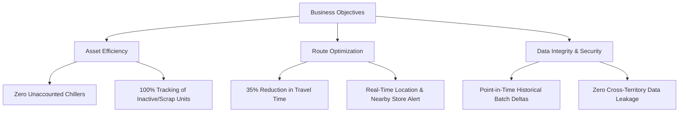
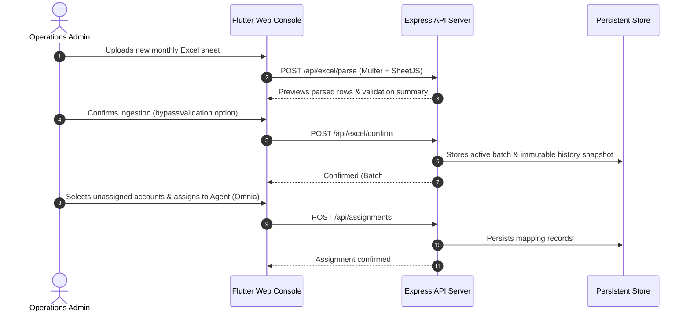
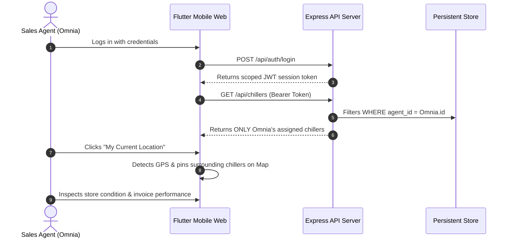

# Business Requirements Document (BRD)
## Bassem Sales Platform — FMCG Asset Intelligence & Field Operations

<!-- LIVING_DOC_METADATA_START -->
> [!NOTE]
> **Live Document Status**: Synchronized with GitHub Repository  
> **Repository**: [Sameh1122/bassem_sales](https://github.com/Sameh1122/bassem_sales)  
> **Last Synchronized**: 2026-10-10 16:41:06 UTC  
> **Active Branch**: `main`  
> **Latest Commit**: [`6d8d84f`](https://github.com/Sameh1122/bassem_sales/commit/6d8d84f) — *"fix: add live health verification endpoint and self-healing auth for Vercel deployment"*  
> **Author**: Sameh1122  
> **Status**: Production Ready & Actively Maintained  
<!-- LIVING_DOC_METADATA_END -->

---

## 1. Executive Summary & Vision

### 1.1 Product Vision
The **Bassem Sales Platform** is an enterprise-grade field operations and asset intelligence solution designed for Fast-Moving Consumer Goods (FMCG) distribution networks. It bridges the critical operational gap between executive sales planning, commercial refrigeration asset management (coolers/chillers), and daily field sales representative execution.

### 1.2 Core Business Problem
FMCG distribution enterprises deploy thousands of refrigeration and cooler assets across varied retail, wholesale, and supermarket accounts. Without a unified intelligent operational platform, organizations suffer from:
1. **Asset Wastage & Lost Inventory**: Expensive refrigeration units sit idle in underperforming stores, are moved without authorization, or break down without timely reporting.
2. **Spreadsheet Version Fragmentation**: Daily or weekly spreadsheet revisions from dispatchers create conflicting datasets, overwritten customer histories, and lost delta visibility.
3. **Field Route Inefficiencies**: Sales agents spend excessive travel time navigating without consolidated geospatial intelligence or surrounding customer visibility.
4. **Data Security & Cross-Territory Leakage**: Unsecured sharing of raw master sheets exposes confidential customer accounts, pricing, and representative phone numbers across unauthorized territories.

### 1.3 Solution Statement
The platform provides a single source of truth that ingests raw Excel sheets, tracks point-in-time historical batches, displays real-time geospatial location maps with custom filtering, enforces strict role-based territory segregation, and equips field reps with mobile-optimized map interfaces.

---

## 2. Stakeholders & User Personas

| Persona | Role | Primary Needs | Key Pain Points |
| :--- | :--- | :--- | :--- |
| **Operations Director / Admin** | Executive System Owner | Universal visibility, batch snapshot history, agent assignment oversight, security & compliance. | Data tampering, accidental DB wipes, unmonitored asset depreciation. |
| **Area Sales Manager** | Territory Supervisor | Mass territory assignment, progress tracking against monthly targets, delta comparison between file versions. | Inability to track which customers were added or eliminated between sheet revisions. |
| **Field Sales Agent (e.g., Omnia)** | On-the-Ground Representative | Mobile map of assigned chillers, surrounding store detection, quick directions, clear asset performance status. | Cluttered datasets showing other reps' accounts, lack of geolocation assistance. |
| **Audit & Asset Inspector** | Operational Compliance | Physical verification of serial numbers, chiller conditions, coordinate validation. | Discrepancies between physical asset coordinates and paper records. |

---

## 3. Business Goals & Objectives (OKRs)

### 3.1 Quantitative Business Targets
- **Asset Retention**: Increase recorded chiller recovery and maintenance rate by **>40%**.
- **Field Visit Density**: Increase completed store visits per agent per day by **25%** through map clustering and location-aware route navigation.
- **Data Freshness**: Enable instant ingestion of new master spreadsheets with **<3 second** validation, zero downtime, and instant automated delta calculation.
- **Access Governance**: **100% isolation** of sales agent accounts, ensuring representatives can only inspect their designated retail accounts.

---

## 4. Functional Requirements (FR)

### 4.1 Ingestion & Sheet Lifecycle Management
- **FR-01: Multi-Format Spreadsheet Upload**: The system shall accept `.xlsx`, `.xls`, and `.csv` files up to 25MB via drag-and-drop or file picker.
- **FR-02: Flexible Schema Extraction**: The system shall automatically parse and display all 36+ standard FMCG spreadsheet columns (Branches, Dates, Chiller Codes, GPS Coordinates, Customer Types, Serial Numbers, Invoices Jan–Dec, YTD, Target Efficiency).
- **FR-03: Formula Injection Protection (DDE)**: The ingestion pipeline shall neutralize formula execution triggers (`=`, `+`, `-`, `@`) to protect exported business reports from spreadsheet execution exploits.
- **FR-04: Batch Snapshotting & Delta Auditing**: Every upload shall create an immutable historical batch record, enabling side-by-side comparison (added accounts, eliminated accounts, changed attributes) between any two uploads.

### 4.2 Interactive Geospatial Intelligence
- **FR-05: Real-Time Map Visualization**: The system shall plot all coordinates onto an interactive OpenStreetMap/Leaflet canvas with marker pins colored by:
  - **Asset Efficiency**: Performing (Green) vs. Underperforming (Red/Orange).
  - **Asset Condition**: Operational, Requires Maintenance, Scrap.
- **FR-06: Geolocation & Surrounding Locations**: The map shall feature a one-click "My Location" service that centers the viewport on the user's current GPS position and highlights surrounding retail accounts within a configurable radius.
- **FR-07: Responsive Map Canvas Controls**: The map widget shall feature quick minimize/maximize toggle controls to provide an unobstructed view of the map or tabular detail.

### 4.3 Data Table, Search & Multi-Column Filtering
- **FR-08: Universal Global Search**: The platform shall provide an instantaneous omni-search input capable of searching across all 36+ columns simultaneously.
- **FR-09: Compound Per-Column Filtering**: Every column header shall feature an interactive filter dialog with:
  - Text search filter.
  - Value-frequency chips showing distinct options and count of occurrences.
- **FR-10: Multi-Column Sorting**: Users can sort any column in Ascending (`▲`) or Descending (`▼`) order with smart numeric sorting for financial amounts and dates.

### 4.4 Territory Assignment & Field Agent Scoping
- **FR-11: Territory Assignment Workflow**: Administrators shall have the ability to assign individual chillers or whole customer accounts to dedicated sales representatives (e.g., Omnia).
- **FR-12: Strict Agent Data Scoping (Horizontal Isolation)**: When a sales representative logs in, the platform shall strictly scope both the data table and the map to their assigned accounts, blocking access to other representatives' territories and unassigned records.

### 4.5 Dynamic Form Generator, Agent Form Execution & Visit Review
- **FR-13: Dynamic Form Builder**: Operations Administrators can dynamically create, edit, and delete visit audit forms with flexible field types:
  - `text`: Single or multi-line observations, serial checks, numeric inputs (e.g., temperature).
  - `choose`: Single-select dropdowns/chips for hygiene ratings and operational state.
  - `attachments`: File and photo uploads (e.g., chiller front and asset condition photographs).
- **FR-14: Role-Based Form Assignment**: Forms can be assigned globally to all agents or individually to targeted sales representatives.
- **FR-15: Map-Integrated Field Execution**: When an agent opens their assigned location on the map, they can fill the assigned audit form, capture photos, and submit the visit. Upon submission, the chiller pin dynamically shifts to a green completed visit state.
- **FR-16: Admin Visit Review & Feedback Loop**: Administrators have a dedicated "Visit Responses & Review Monitor" tab to review submitted audits, inspect uploaded photo attachments, and either Approve (Accept) or Re-open the audit with feedback for the agent.

---

## 5. Non-Functional Requirements (NFR)

| Ref | Category | Specification |
| :--- | :--- | :--- |
| **NFR-01** | **Performance** | API responses for filtered queries under 10,000 records must resolve in **< 120ms**. Initial page bundle load in **< 1.5s**. |
| **NFR-02** | **Security** | Passwords hashed using PBKDF2 with 100,000 iterations of SHA-512 and unique salts. Constant-time byte comparisons to eliminate timing attacks. |
| **NFR-03** | **Access Governance** | Strict Role-Based Access Control (RBAC): `admin` vs `agent`. Zero horizontal privilege escalation. |
| **NFR-04** | **Availability & Resilience** | System must operate seamlessly both locally (offline-first Node.js server) and in serverless cloud environments (Vercel). |
| **NFR-05** | **Responsive Design** | 100% usable on mobile devices (smartphones in the field), tablets, and high-resolution desktop management consoles. |
| **NFR-06** | **Data Integrity** | Atomic write operations for all database mutations to prevent data corruption during simultaneous uploads or assignments. |
| **NFR-07** | **Brute-Force Defense** | Rate limiting enforcing a 5-minute cooldown after 5 failed login attempts per IP and per account identifier. |

---

## 6. End-to-End User Workflows

### 6.1 Administrator Ingestion & Assignment Workflow

### 6.2 Field Sales Representative Workflow

---

## 7. Data Dictionary & Standard Columns

The platform dynamically supports all original Excel spreadsheet columns:

| Column Key | Business Meaning | Data Type | Filterable |
| :--- | :--- | :--- | :--- |
| `Branch` | Sales branch territory (e.g., Cairo East, Alex) | Text | Yes |
| `Received Date` | Date chiller delivered to customer | Date | Yes |
| `Chiller Code` | Unique physical identifier (e.g., `CH-00123`) | Text (Key) | Yes |
| `Chiller Type` | Equipment model / capacity | Text | Yes |
| `Chiller Status` | Active, Inactive, Maintenance | Categorical | Yes |
| `Condition` | Good, Fair, Poor, Scrap | Categorical | Yes |
| `Latitude` / `Longitude`| GPS coordinates for geospatial plotting | Float | Yes |
| `Customer Name` | Registered outlet / business name | Text | Yes |
| `Customer Address` | Physical street address | Text | Yes |
| `Mobile Number` | Merchant contact phone | Text | Yes |
| `Jan–Dec Invoice` | Monthly invoice billing amounts | Currency | Yes |
| `YTD` | Year-to-date sales revenue | Currency | Yes |
| `Month Ach. Status`| Target achievement (Performing / Underperforming) | Categorical | Yes |

---

## 8. Living Document Maintenance Policy

1. **Automated Synchronization**: Every push to the GitHub repository automatically updates the document timestamp and commit metadata via `.github/workflows/update-docs.yml` and `scripts/update-docs.js`.
2. **Schema Drift Detection**: When new spreadsheet columns or endpoints are registered in `api/index.js`, the documentation synchronizer verifies and registers updates.
3. **Change Approval**: Modifications to core business requirements require review and sign-off by the Operations Administrator.
