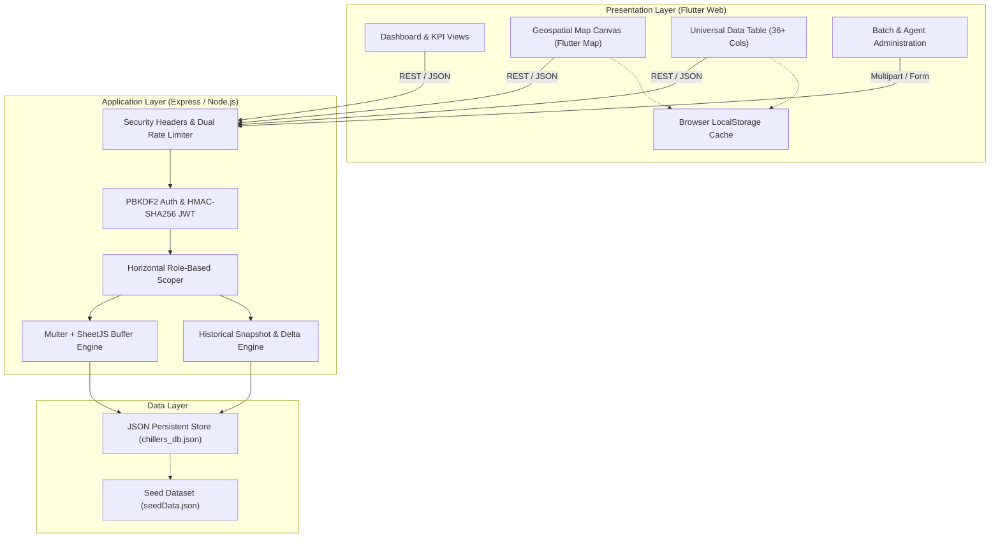
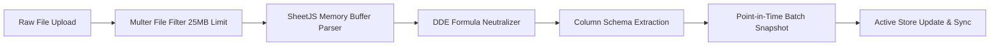
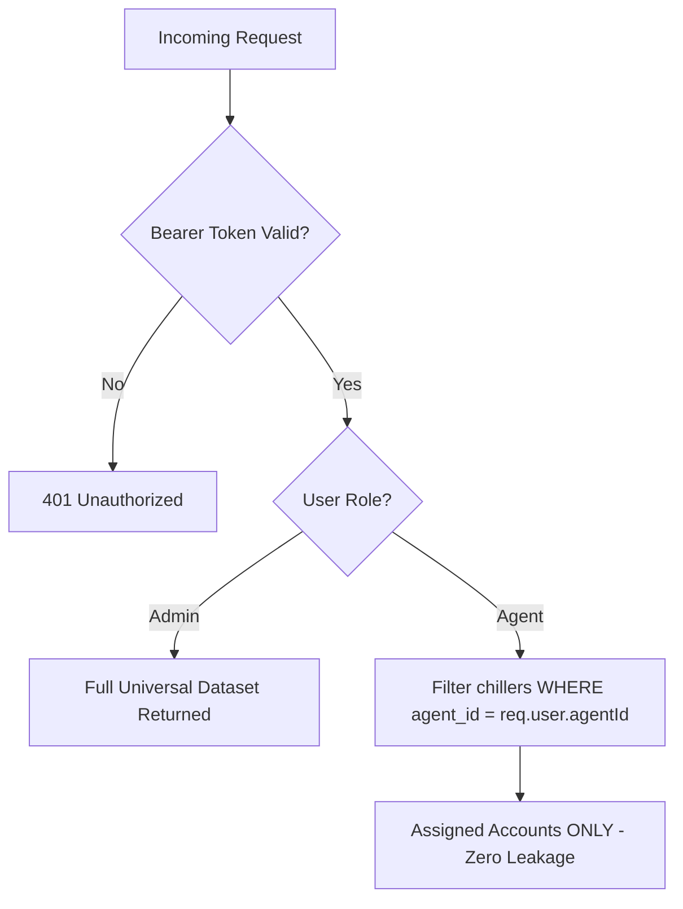
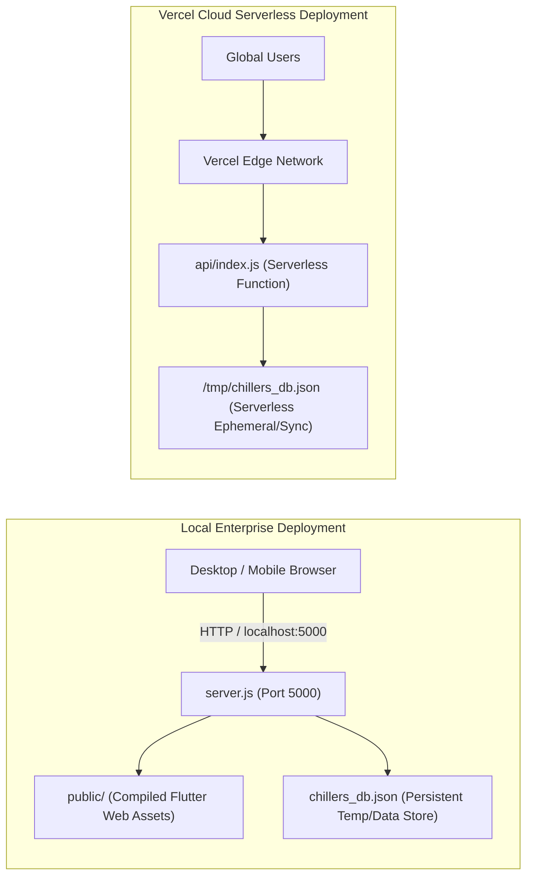

# Solution Architecture Document (SAD)
## Bassem Sales Platform — FMCG Asset Intelligence & Field Operations

<!-- LIVING_DOC_METADATA_START -->
> [!NOTE]
> **Live Document Status**: Synchronized with GitHub Repository  
> **Repository**: [Sameh1122/bassem_sales](https://github.com/Sameh1122/bassem_sales)  
> **Last Synchronized**: 2026-10-10 12:27:12 UTC  
> **Active Branch**: `main`  
> **Latest Commit**: [`de3333e`](https://github.com/Sameh1122/bassem_sales/commit/de3333e) — *"docs: auto-synchronize live BRD & SAD metadata [skip ci]"*  
> **Author**: GitHub Action [Docs Sync]  
> **Status**: Production Ready & Actively Maintained  
<!-- LIVING_DOC_METADATA_END -->

---

## 1. System Overview & Architecture Context

The **Bassem Sales Platform** is designed as a hybrid offline-capable client-server application. It couples a responsive **Flutter Web (Dart)** single-page application with a high-performance **Node.js / Express** API server.

---

## 2. Technology Stack & Component Specifications

| Architecture Layer | Technology | Version | Key Responsibility |
| :--- | :--- | :--- | :--- |
| **Frontend Framework** | **Flutter Web (Dart)** | `3.x` | Cross-platform web client rendering responsive UI with Material 3. |
| **Geospatial Mapping** | **Flutter Map / LatLong2** | `v6.x` | OpenStreetMap tile rendering, custom condition pin coloring, marker clustering. |
| **Client Storage** | **Browser LocalStorage / Web APIs** | Native | Caching active dataset, auth token, and offline session resilience. |
| **API Server Engine** | **Express.js (ESM)** | `^4.19.2` | REST routing, CORS handling, custom security middlewares, request parsing. |
| **Spreadsheet Engine** | **SheetJS / xlsx** | `^0.18.5` | In-memory binary buffer extraction, column sanitization, dynamic cell mapping. |
| **Upload Processing** | **Multer** | `^1.4.5-lts.1` | Memory storage buffer streaming, 25MB file size limit, extension validation. |
| **Cryptography** | **Node.js Crypto** | Native | PBKDF2 with SHA-512 (100k rounds), timingSafeEqual, HMAC-SHA256 JWTs. |
| **Runtime & Host** | **Node.js** | `v20+ / v22` | Server runtime, local daemon execution, Vercel Serverless Function export. |

---

## 3. Core Component Architectures

### 3.1 Spreadsheet Ingestion & Batch Snapshot Pipeline

1. **Validation & Neutralization**:
   - Every text value is parsed through `cleanStr()`.
   - Any cell starting with `=`, `+`, `-`, or `@` is automatically escaped with a leading single quote (`'`), permanently eliminating CSV/Excel DDE formula injection attacks.
2. **Batch Snapshots**:
   - Each upload assigns an autoincrementing `batchId`.
   - Records are appended to both the active `chillers` collection and an immutable `history` collection, capturing exact point-in-time states.

### 3.2 Geospatial & Location Engine
- **Coordinate Handling**: Latitudes and Longitudes are parsed and normalized.
- **Marker Color Encoding**:
  - Green (`#10B981`): Performing monthly target.
  - Orange (`#F59E0B`): Underperforming account.
  - Red (`#EF4444`): Scrap / Defective chiller.
- **My Location & Surrounding Store Radar**:
  - HTML5 Geolocation API retrieves user coordinates with fallback to IP location.
  - Computes spatial proximity using the Haversine formula to surface nearby customer accounts.

### 3.3 Access Control & Horizontal Role Isolation Engine

- **Endpoint Scoping Matrix**:
  - `/api/chillers`: Administrators receive all records; sales agents receive strictly their assigned chillers.
  - `/api/chillers/latest-batch`: Prevents foreign territory inspection by sales agents.
  - `/api/assignments`: Agents only see their personal assignment roster.
  - `/api/batches`, `/api/delta`, `/api/chillers/clear`: Restricted to `requireAdmin` with `403 Forbidden` enforcement.

---

## 4. Security Architecture & Threat Model (STRIDE)

| Threat Category | Potential Vector | Platform Mitigation Architecture |
| :--- | :--- | :--- |
| **Spoofing** | Forged JWT credentials | HMAC-SHA256 signature verification using an ephemeral 256-bit runtime CSPRNG key (`crypto.randomBytes(32)`). |
| **Tampering** | Formula injection in Excel / CSV | `cleanStr()` sanitization escaping dangerous symbols (`=`, `+`, `-`, `@`). |
| **Repudiation** | Unverified administrative deletions | `requireAdmin` authorization gates on `DELETE /api/chillers/clear` and `DELETE /api/batches/:id` with atomic disk persistence. |
| **Information Disclosure** | Server banner leakage | `x-powered-by` disabled across Express instances; `X-Content-Type-Options: nosniff` and `X-Frame-Options: SAMEORIGIN` headers enforced. |
| **Denial of Service** | Login credential brute forcing | Dual-tier rate limiting tracking both client IP and user identifier with a 5-minute lockout upon 5 failed attempts; automatic garbage collection every 10 minutes. |
| **Elevation of Privilege** | Timing attack on hash comparisons | `crypto.timingSafeEqual` constant-time byte comparisons across password verifications and JWT signatures. |

---

## 5. API Endpoint Architecture & Contract Matrix

<!-- API_MATRIX_START -->
| Method | Endpoint Path | Access Level | Description |
| :--- | :--- | :--- | :--- |
| `POST` | `/api/auth/login` | Public (Rate-Limited) | Authenticates administrator or field agent. |
| `GET` | `/api/auth/me` | Authenticated | Returns current authenticated user session details. |
| `POST` | `/api/auth/change-password` | Authenticated | Updates current user password with complexity policy. |
| `POST` | `/api/auth/reset-agent-password`| Admin Only | Administrator password reset for sales agents. |
| `GET` | `/api/columns` | Authenticated | Fetches dynamic column schema definitions. |
| `POST` | `/api/columns` | Admin Only | Creates custom spreadsheet column attribute. |
| `POST` | `/api/columns/toggle` | Admin Only | Toggles active or required status for column. |
| `POST` | `/api/excel/parse` | Admin Only | Multipart Excel file parse & preview. |
| `GET` | `/api/excel/scratch-sample` | Admin Only | Loads default sample spreadsheet for testing. |
| `POST` | `/api/excel/confirm` | Admin Only | Ingests parsed batch into active store and history. |
| `GET` | `/api/chillers` | Authenticated (Scoped)| Queries chillers with search and filter parameters. |
| `GET` | `/api/chillers/latest-batch` | Authenticated (Scoped)| Retrieves chillers for territory assignment. |
| `DELETE`| `/api/chillers/clear` | Admin Only | Clears active database records. |
| `GET` | `/api/batches` | Admin Only | Lists historical upload batches. |
| `DELETE`| `/api/batches/:id` | Admin Only | Deletes specific batch and historical snapshot. |
| `GET` | `/api/delta` | Admin Only | Compares two historical batches (added/removed/modified). |
| `GET` | `/api/agents` | Authenticated | Retrieves sales representative roster. |
| `POST` | `/api/agents` | Admin Only | Registers a new sales representative. |
| `PUT` | `/api/agents/:id` | Admin Only | Updates sales representative profile. |
| `DELETE`| `/api/agents/:id` | Admin Only | Deletes sales representative and unassigns chillers. |
| `GET` | `/api/assignments` | Authenticated (Scoped)| Retrieves location-to-agent assignments. |
| `POST` | `/api/assignments` | Admin Only | Assigns chillers or customer names to an agent. |
| `DELETE`| `/api/assignments` | Admin Only | Unassigns chiller or customer from agent. |
| `GET` | `/api/forms` | Admin Only | Lists all dynamic forms created in the system. |
| `POST` | `/api/forms` | Admin Only | Creates a dynamic audit form with custom fields. |
| `PUT` | `/api/forms/:id` | Admin Only | Updates a form's schema, fields, or assignments. |
| `DELETE`| `/api/forms/:id` | Admin Only | Deletes a dynamic form and its definitions. |
| `GET` | `/api/forms/assigned` | Authenticated (Agent/Admin) | Fetches forms assigned to current agent session. |
| `POST` | `/api/form-responses` | Authenticated (Agent/Admin) | Submits a completed visit audit with answers & attachments. |
| `GET` | `/api/form-responses` | Authenticated (Scoped) | Retrieves submitted visit audits and responses. |
| `PUT` | `/api/form-responses/:id/review` | Admin Only | Accepts visit audit or re-opens with admin feedback. |
| `POST` | `/api/upload-attachment` | Authenticated | Multi-part upload for audit visit photos. |
<!-- API_MATRIX_END -->

---

## 6. Deployment Architecture & Operational Topology

1. **Local Production Daemon**:
   - Commanded via `npm start` (`node server.js`).
   - Serves static Flutter Web build from `public/` and routes API requests to `api/index.js`.
   - Maintains continuous offline-first operational status on port 5000.
2. **Cloud Serverless Mode**:
   - `vercel.json` redirects all `/api/*` traffic to the entry point in `api/index.js`.
   - Seamlessly compatible with serverless invocations.

---

## 7. Living Documentation CI/CD Automation

This document is configured as a **Living Architecture Document** maintained via:
1. **GitHub Actions Workflow** (`.github/workflows/update-docs.yml`):
   - Triggers on every `push` event to the repository.
   - Synchronizes Git commit SHAs, author metadata, and build timestamps.
2. **Local Pre-Push Sync Hook** (`scripts/update-docs.js`):
   - Automatically runs before any `git push` to ensure the architectural specification matches the codebase.
